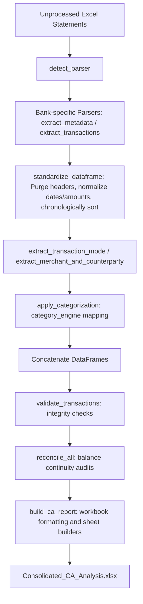

# CA_Analyzer Project Context

## Overview
`CA_Analyzer` is a modular, production-grade financial statement analysis and consolidation tool designed for Chartered Accountant (CA) and income tax return (ITR) audit compliance. It reads unprocessed bank statements (HDFC, ICICI, SBI) in Excel formats (`.xls`, `.xlsx`), normalizes transaction structures, validates schema layout and transaction integrity, runs reconciliation audits, maps transactions to categories/merchants using keyword rules, runs multi-dimensional financial analytics, and outputs a consolidated multi-sheet Excel report with visualization charts and an executive KPI dashboard.

---

## Folder Structure
Below is the full folder structure of the CA_Analyzer repository:

```text
CA_Analyzer/
├── Excel_Analyzer1 11.52.59 AM.py
├── consolidater.py
└── ca_analyzer/
    ├── __init__.py
    ├── consolidator.py
    ├── main.py
    ├── config/
    │   ├── bank_rules.yaml
    │   ├── category_rules.yaml
    │   ├── styles.yaml
    │   └── thresholds.yaml
    ├── core/
    │   ├── config.py
    │   ├── constants.py
    │   ├── exceptions.py
    │   ├── logger.py
    │   ├── schemas.py
    │   └── utilities.py
    ├── parsers/
    │   ├── base_parser.py
    │   ├── hdfc_parser.py
    │   ├── icici_parser.py
    │   └── sbi_parser.py
    ├── normalization/
    │   └── standardizer.py
    ├── validation/
    │   ├── reconciliation.py
    │   ├── schema_validator.py
    │   └── transaction_validator.py
    ├── transaction_engine/
    │   ├── category_engine.py
    │   ├── merchant_extractor.py
    │   ├── narration_parser.py
    │   └── rules.py
    ├── analytics/
    │   ├── __init__.py
    │   ├── cash_deposit_analysis.py
    │   ├── dashboard.py
    │   ├── expense_analysis.py
    │   ├── gst_analysis.py
    │   ├── high_value_transactions.py
    │   ├── income_analysis.py
    │   ├── investment_analysis.py
    │   ├── loan_analysis.py
    │   ├── risk_flags.py
    │   └── tds_analysis.py
    ├── presentation/
    │   ├── __init__.py
    │   ├── charts.py
    │   ├── report_builder.py
    │   ├── styles.py
    │   ├── workbook_formatter.py
    │   └── dashboard/
    │       ├── __init__.py
    │       ├── charts_data.py
    │       ├── dashboard_sheet.py
    │       ├── kpis.py
    │       └── summary_cards.py
    └── tests/
        ├── __init__.py
        ├── test_analytics.py
        ├── test_categorizer.py
        ├── test_consolidator.py
        ├── test_parsers.py
        └── test_standardizer.py
```

---

## Detailed File and Logic Breakdown

### 1. Root Scripts

#### 📄 [Excel_Analyzer1 11.52.59 AM.py](file:///Users/ajinkyawagh/Desktop/Internship/CA_Analyzer/Excel_Analyzer1%2011.52.59%E2%80%AFAM.py)
* **Purpose**: Provides a command-line interface (CLI) wrapper to analyze a single bank statement and output a formatted report.
* **Logic**:
  * Leverages Python's `argparse` to parse:
    * `--input` (Required): Path to bank statement (`.xls` or `.xlsx`).
    * `--output` (Optional): Target Excel report output path (falls back to `<input_basename>_CA_Analysis.xlsx`).
    * `--name`, `--bank`, `--account`, `--type`: Standard metadata tags (retains these for backwards compatibility with earlier versions).
  * Validates that the input file exists on disk, then calls `consolidate_statements([args.input], output_path)` from `ca_analyzer.consolidator`.

#### 📄 [consolidater.py](file:///Users/ajinkyawagh/Desktop/Internship/CA_Analyzer/consolidater.py)
* **Purpose**: Developer utility script to run the pipeline on a predefined set of bank statements for a particular user (Sanjay Jindal) and year (FY 2024-25).
* **Logic**:
  * Defines a hardcoded list of target statements:
    * `SANJAY JINDAL HDFC BANK STATEMENT FY 2024-25.xls`
    * `SANJAY JINDAL ICICI BANK FY 2024-25.xls`
    * `SANJAY JINDAL SBI 2024-25.xlsx`
  * Resolves file paths: looks for the files in the current working directory, then falls back to `Bank Statements/Unprocessed/`.
  * Calls `consolidate_statements` with the resolved files list to output `Consolidated_CA_Analysis.xlsx` in the current directory.

---

### 2. Core Package Configuration and Utilities (`ca_analyzer/core/`)

#### 📄 [ca_analyzer/core/config.py](file:///Users/ajinkyawagh/Desktop/Internship/CA_Analyzer/ca_analyzer/core/config.py)
* **Purpose**: Implements a configuration manager singleton pattern (`AppConfig`).
* **Logic**:
  * During class instantiation (`__new__`), checks if a private singleton class instance exists. If not, initializes and calls `_load_all_configs()`.
  * `_load_all_configs` reads and parses YAML configurations from the sibling `config/` directory:
    * `thresholds.yaml` (saved to `self.thresholds`)
    * `category_rules.yaml` (saved to `self.category_rules`)
    * `bank_rules.yaml` (saved to `self.bank_rules`)
    * `styles.yaml` (saved to `self.styles`)
  * Exposes the configured instance globally as `config`.

#### 📄 [ca_analyzer/core/constants.py](file:///Users/ajinkyawagh/Desktop/Internship/CA_Analyzer/ca_analyzer/core/constants.py)
* **Purpose**: Defines system-wide constant values.
* **Logic**:
  * Declares `BANKS = ["HDFC", "ICICI", "SBI"]` which represents the supported set of banking parsers.

#### 📄 [ca_analyzer/core/exceptions.py](file:///Users/ajinkyawagh/Desktop/Internship/CA_Analyzer/ca_analyzer/core/exceptions.py)
* **Purpose**: Defines custom exception classes to facilitate clean error handling and debugging.
* **Logic**:
  * Inherits from Python's base `Exception`:
    * `AnalyzerError`: Base error class for all `ca_analyzer` system failures.
    * `ParserError` (subclass of `AnalyzerError`): Raised when parsing/extracting data from a bank statement fails.
    * `SchemaError` (subclass of `AnalyzerError`): Raised when a dataframe violates the canonical column schema.
    * `ReconciliationError` (subclass of `AnalyzerError`): Raised when balance continuity check or closing balance audit checks fail.
    * `RuleError` (subclass of `AnalyzerError`): Raised when category mapping or classification engine issues arise.

#### 📄 [ca_analyzer/core/logger.py](file:///Users/ajinkyawagh/Desktop/Internship/CA_Analyzer/ca_analyzer/core/logger.py)
* **Purpose**: Configures standard logging outputs to print execution details.
* **Logic**:
  * Exposes `get_logger(name)`.
  * If the logger has no handlers, configures it with a `StreamHandler` printing to standard out (`sys.stdout`) at standard level `logging.INFO` with timestamp, name, level, and message formats.

#### 📄 [ca_analyzer/core/schemas.py](file:///Users/ajinkyawagh/Desktop/Internship/CA_Analyzer/ca_analyzer/core/schemas.py)
* **Purpose**: Specifies schema structures to guarantee that all downstream modules process uniform transaction fields.
* **Logic**:
  * Declares `CANONICAL_COLUMNS`: `["Person_Name", "Bank_Name", "Account_Number", "IFSC", "Statement_Start", "Statement_End", "Date", "Narration", "Chq_Ref", "Debit", "Credit", "Balance", "Merchant_Name", "Transaction_Mode", "Counterparty", "Category", "Sub_Category", "txn_seq"]`.
  * Declares `CANONICAL_TYPES` mapping each canonical column to its expected data type (e.g., `Date` as pandas DateTime/Timestamp, float fields for Debit/Credit/Balance, string fields for metadata/narration, integer fields for sequence `txn_seq`).

#### 📄 [ca_analyzer/core/utilities.py](file:///Users/ajinkyawagh/Desktop/Internship/CA_Analyzer/ca_analyzer/core/utilities.py)
* **Purpose**: Exposes text processing, math, date calculations, and currency formatter tools.
* **Logic**:
  * `parse_amount(val)`: Removes currency symbols (`₹`), commas, and spaces. Converts bracketed numbers (e.g., `(100)`) representing negative outflows to floating negatives, cleans non-numeric letters using regular expressions, and defaults non-parseable values to `0.0`.
  * `parse_date(val)`: Normalizes date inputs. If already a datetime or timestamp, returns it. Otherwise, iterates through a list of 12 date formats (e.g., `%d-%m-%Y`, `%d/%m/%Y`, `%Y-%m-%d`, `%d-%b-%Y`, etc.). Falls back to `pd.to_datetime(val, dayfirst=True)` and defaults to `pd.NaT` (Not a Time) on failure.
  * `get_financial_year(dt)`: Takes a date and checks the month. If month >= 4, financial year is `"{year}-{last_two_digits_of_next_year}"` (e.g. 2024-25). If month < 4, it is `"{year - 1}-{last_two_digits_of_year}"`.
  * `fy_to_ay(fy)`: Computes Assessment Year (AY) from Financial Year (FY) by adding 1 year to the start index (e.g. FY 2024-25 maps to AY 2025-26).
  * `fy_bounds(fy)`: Returns standard start/end date bounds for an FY (April 1st of start year to March 31st of next year).
  * `format_inr(v)`: Formats numeric values to Indian Rupee (INR) representation with Lakhs and Crores groupings (e.g., formats `123456.78` as `₹ 1,23,456.78`).

---

### 3. Parsing Component (`ca_analyzer/parsers/`)

#### 📄 [ca_analyzer/parsers/base_parser.py](file:///Users/ajinkyawagh/Desktop/Internship/CA_Analyzer/ca_analyzer/parsers/base_parser.py)
* **Purpose**: Base abstract class outlining the interface for bank-specific statement parsers.
* **Logic**:
  * Subclasses must override `extract_metadata()` and `extract_transactions()`.
  * `parse()`: Unified entry point. Orchestrates the workflow:
    1. Extracts metadata dictionary (name, bank name, account number, IFSC, start and end dates).
    2. Extracts transaction details into a raw DataFrame.
    3. Populates metadata properties as static columns on each transaction row of the DataFrame.

#### 📄 [ca_analyzer/parsers/hdfc_parser.py](file:///Users/ajinkyawagh/Desktop/Internship/CA_Analyzer/ca_analyzer/parsers/hdfc_parser.py)
* **Purpose**: Custom parser for HDFC XLS files.
* **Logic**:
  * Utilizes `xlrd` to read the Excel sheet.
  * `extract_metadata()`: Reads first 30 rows. Cleans "MR.", "MRS.", "MS." prefixes from row 5 column A to get the `Person_Name`. Searches for "Account No :", "IFSC :", and statement dates ("Statement From" / "Statement Period") using regex matching.
  * `extract_transactions()`: Finds transaction headers (searching first 50 rows for cells containing "date", "narration", and "closing balance"). Appends rows that follow until hitting empty blocks or warning/disclaimer footnotes. Standardizes the columns to raw names: `raw_date`, `raw_narration`, `raw_chq_ref`, `raw_debit`, `raw_credit`, `raw_balance`.

#### 📄 [ca_analyzer/parsers/icici_parser.py](file:///Users/ajinkyawagh/Desktop/Internship/CA_Analyzer/ca_analyzer/parsers/icici_parser.py)
* **Purpose**: Custom parser for ICICI statements.
* **Logic**:
  * Fits the updated design constraints described in `plan.md`.
  * `extract_metadata()`: Scans the first 50 rows. Finds the cell containing "Account Number" and splits on `-` to isolate `Account_Number` (left-hand side) and `Person_Name` (right-hand side). Finds the date range using `Transaction Date from` and regex extraction.
  * `_find_header_row()`: Finds the header row dynamically by checking if a row contains at least 3 keywords: `"transaction date"`, `"transaction remarks"`, `"withdrawal"`, `"deposit"`, `"balance"`.
  * `extract_transactions()`: Reads transaction rows starting from the header row index + 1. It filters out empty rows and validates transaction rows by making sure that `Transaction Date` is populated. It does **not** rely on `S No.` or `s_no` sequence validation.
  * Removes duplicate transaction blocks by applying `drop_duplicates` on subset: `["Transaction Date", "Transaction Remarks", "Withdrawal Amount (INR )", "Deposit Amount (INR )", "Balance (INR )"]`.
  * Standardizes columns to `raw_date`, `raw_narration`, `raw_chq_ref`, `raw_debit`, `raw_credit`, `raw_balance`, clean values through `parse_date` and `parse_amount`, reconciles sums, and runs assertions before returning the dataframe.

#### 📄 [ca_analyzer/parsers/sbi_parser.py](file:///Users/ajinkyawagh/Desktop/Internship/CA_Analyzer/ca_analyzer/parsers/sbi_parser.py)
* **Purpose**: Custom parser for SBI XLSX sheets.
* **Logic**:
  * Uses `openpyxl` with `data_only=True` to read formula outcomes.
  * `extract_metadata()`: Searches the first 25 rows for "Account Name", "Account Number", "IFS Code", "Start Date", "End Date" to fill metadata.
  * `extract_transactions()`: Searches the first 30 rows for headers matching "txn date", "description", "balance". Reads data rows until hitting footer keywords such as "total", "statement", or "note". Standardizes headers to raw formats (`raw_date`, etc.) and maps them.

---

### 4. Normalization Component (`ca_analyzer/normalization/`)

#### 📄 [ca_analyzer/normalization/standardizer.py](file:///Users/ajinkyawagh/Desktop/Internship/CA_Analyzer/ca_analyzer/normalization/standardizer.py)
* **Purpose**: Standardizes raw bank-specific dataframes.
* **Logic**:
  * Purges duplicate header rows: row values are scanned against a set of header keywords (e.g. `DATE`, `DEBIT`, `CREDIT`, `BALANCE`, `CATEGORY`). If 2 or more keywords match a row's contents, that row is classified as a duplicate header row and dropped.
  * Renames raw parser columns to standard database names (`Date`, `Narration`, `Chq_Ref`, `Debit`, `Credit`, `Balance`).
  * Normalizes the `Date` column using `parse_date` and drops rows with invalid dates.
  * Reverses dataframe ordering if the statement dates run from Newest to Oldest (detected by comparing the first and last dates in the sequence).
  * Assigns the chronological transaction sequence numbers (`txn_seq`) from `0` to `len(df) - 1`.
  * Cleans amount fields (`Debit`, `Credit`, `Balance`) to floats.
  * Adds and pads missing fields to conform the output strictly to `CANONICAL_COLUMNS`.

---

### 5. Validation and Auditing Component (`ca_analyzer/validation/`)

#### 📄 [ca_analyzer/validation/schema_validator.py](file:///Users/ajinkyawagh/Desktop/Internship/CA_Analyzer/ca_analyzer/validation/schema_validator.py)
* **Purpose**: Schema structure validation.
* **Logic**:
  * Checks if all fields defined in `CANONICAL_COLUMNS` exist in the dataframe. If any column is missing, raises `SchemaError`.

#### 📄 [ca_analyzer/validation/transaction_validator.py](file:///Users/ajinkyawagh/Desktop/Internship/CA_Analyzer/ca_analyzer/validation/transaction_validator.py)
* **Purpose**: Evaluates individual transaction integrity.
* **Logic**:
  * Verifies that `Date` is not null (raises `SchemaError` on null dates).
  * Enforces that a transaction cannot have both `Debit` and `Credit` greater than zero (raises `ReconciliationError` if both are populated).
  * Performs duplicate transaction checks based on `["Date", "Narration", "Debit", "Credit", "Balance"]` and outputs warning counts in logs.

#### 📄 [ca_analyzer/validation/reconciliation.py](file:///Users/ajinkyawagh/Desktop/Internship/CA_Analyzer/ca_analyzer/validation/reconciliation.py)
* **Purpose**: Performs double-entry auditing and ledger balance continuity checks.
* **Logic**:
  * `reconcile_bank()`: Isolates transactions for a specific bank and account, sorting them by `txn_seq`. Loops through rows checking that `prev_balance - Debit + Credit == current_balance` within a tolerance threshold of 1.0 INR. Raises `ReconciliationError` if a discrepancy is found. It also back-calculates the opening balance of the statement and checks if `opening_balance + total_credits - total_debits == closing_balance`.
  * `reconcile_all()`: Groups the master transaction ledger by `Bank_Name` and `Account_Number` and triggers `reconcile_bank` on each.

---

### 6. Transaction Engine Component (`ca_analyzer/transaction_engine/`)

#### 📄 [ca_analyzer/transaction_engine/narration_parser.py](file:///Users/ajinkyawagh/Desktop/Internship/CA_Analyzer/ca_analyzer/transaction_engine/narration_parser.py)
* **Purpose**: Categorizes the payment mechanism.
* **Logic**:
  * Scans narration strings for keywords to extract `Transaction_Mode`:
    * `"upi"` -> `UPI`
    * `"neft"` -> `NEFT`
    * `"rtgs"` -> `RTGS`
    * `"imps"` -> `IMPS`
    * `"atm"`, `"cash wd"`, `"cash withdrawal"` -> `ATM`
    * `"cash"`, `"cdm"`, `"deposit cash"` -> `CASH`
    * `"chq"`, `"cheque"`, `"clg"` -> `CHEQUE`
    * `"interest"`, `"int cr"` -> `INTEREST`
    * `"charge"`, `"fee"`, `"charges"` -> `CHARGE`
    * Default: `TRANSFER`

#### 📄 [ca_analyzer/transaction_engine/merchant_extractor.py](file:///Users/ajinkyawagh/Desktop/Internship/CA_Analyzer/ca_analyzer/transaction_engine/merchant_extractor.py)
* **Purpose**: Extracts merchants and counterparties from narration strings.
* **Logic**:
  * **UPI**: Splits by `/` or `-`. Extracts the third token (or second token if hyphenated) as `Counterparty` (removing payment prefaces) and the UPI handle name (before the `@`) as `Merchant_Name`.
  * **NEFT/RTGS**: Splits by `/` to identify bank transfers and counterparty names.
  * **IMPS**: Parses between slashes to isolate the target recipient.
  * **ATM/CASH/CDM**: Sets Merchant as `ATM/CASH` and Counterparty as `Self`.
  * **Cleanups**: Defaults short strings or numeric codes (e.g. transaction IDs) to `"OTHERS"` for Merchant and `"N/A"` for Counterparty.

#### 📄 [ca_analyzer/transaction_engine/rules.py](file:///Users/ajinkyawagh/Desktop/Internship/CA_Analyzer/ca_analyzer/transaction_engine/rules.py)
* **Purpose**: Wrapper to query categorization rules from YAML config.
* **Logic**:
  * Exposes `get_category_rules()` returning `config.category_rules` dictionary.

#### 📄 [ca_analyzer/transaction_engine/category_engine.py](file:///Users/ajinkyawagh/Desktop/Internship/CA_Analyzer/ca_analyzer/transaction_engine/category_engine.py)
* **Purpose**: Assigns financial tax categories and subcategories based on keywords.
* **Logic**:
  * `categorise_transaction()`:
    * **Credit (Inflow)**: Matches narration against keywords inside `credit_categories` config (e.g. maps "salary" to Category `Salary` and subcategory `Salary Income`). Defaults to Category `Miscellaneous` / Sub-category `Miscellaneous Inflow`.
    * **Debit (Outflow)**: Checks Cash Withdrawal rules first. Uses `cash_withdrawal_exclude` to ensure card fees, annual fees, or reversals aren't tagged as physical cash withdrawals. Then matches other categories (Loans, Insurance, Taxes, Investments, Food, Travel, Medical, Shopping). Defaults to Category `Others` / Sub-category `Other Expense`.
  * `apply_categorization()`: Iterates through the dataframe, calls `categorise_transaction` on each row, and appends the resulting `Category` and `Sub_Category` columns.

---

### 7. Analytics Component (`ca_analyzer/analytics/`)

#### 📄 [ca_analyzer/analytics/__init__.py](file:///Users/ajinkyawagh/Desktop/Internship/CA_Analyzer/ca_analyzer/analytics/__init__.py)
* **Purpose**: Analytics package initialization. Exposes all analytical functions globally under the `ca_analyzer.analytics` namespace.

#### 📄 [ca_analyzer/analytics/income_analysis.py](file:///Users/ajinkyawagh/Desktop/Internship/CA_Analyzer/ca_analyzer/analytics/income_analysis.py)
* **Purpose**: Summarizes the client's income streams.
* **Logic**:
  * Filters inflow credits (`Credit > 0.0`).
  * Classifies inflows into categories: `Salary` (if category is Salary), `Rent` (if category is House Property), `Interest` (interest keywords), `Business Receipts` (Business/Profession or GST refund), `Refunds` (reversals/refunds), and `Miscellaneous`.
  * Groups transactions by `Income Type` and `Bank` and aggregates using `sum` of `Credit` (Amount) and `count` (Frequency).

#### 📄 [ca_analyzer/analytics/expense_analysis.py](file:///Users/ajinkyawagh/Desktop/Internship/CA_Analyzer/ca_analyzer/analytics/expense_analysis.py)
* **Purpose**: Summarizes client expenditures.
* **Logic**:
  * Filters debits (`Debit > 0.0`).
  * Maps categories into display types: `Utilities`, `Insurance`, `Taxes`, `Investments`, `Rent Payments`, `Loan Payments`, `Cash Withdrawals`, `Cheque Bounces`, `Food`, `Travel`, `Shopping`, `Medical`, and `Others`.
  * Groups transactions by `Expense Category` and `Bank` and aggregates the `sum` and `count` of `Debit`.

#### 📄 [ca_analyzer/analytics/gst_analysis.py](file:///Users/ajinkyawagh/Desktop/Internship/CA_Analyzer/ca_analyzer/analytics/gst_analysis.py)
* **Purpose**: Isolates GST-related tax transactions.
* **Logic**:
  * Filters transactions where the narration contains the keyword `"gst"`.
  * Classifies rows:
    * `Debit > 0` -> Type is `GST Payment`
    * `Credit > 0` and narration contains "refund" -> Type is `GST Refund`
    * `Credit > 0` and not a refund -> Type is `GST Receipt`
  * Returns formatted columns: `["Date", "Bank", "Narration", "Amount", "Type"]`.

#### 📄 [ca_analyzer/analytics/tds_analysis.py](file:///Users/ajinkyawagh/Desktop/Internship/CA_Analyzer/ca_analyzer/analytics/tds_analysis.py)
* **Purpose**: Identifies tax deduction transactions (TDS).
* **Logic**:
  * Scans narration for TDS keywords: `"tds"`, `"194a"`, `"194j"`, `"194c"`, `"tax deducted"`.
  * Maps TDS transactions to Income Tax Act sections:
    * `"194a"` or `"int"` -> `Sec 194A (Interest)`
    * `"194j"` or `"prof"` -> `Sec 194J (Professional Fees)`
    * `"194c"` or `"contract"` -> `Sec 194C (Contractors)`
    * Otherwise -> `Sec 194 (TDS General)`
  * Returns a summary dataframe containing `Date`, `Bank`, `Narration`, `Amount`, and `Section`.

#### 📄 [ca_analyzer/analytics/investment_analysis.py](file:///Users/ajinkyawagh/Desktop/Internship/CA_Analyzer/ca_analyzer/analytics/investment_analysis.py)
* **Purpose**: Audits the client's investment and insurance outflows.
* **Logic**:
  * Filters rows classified under category/subcategory `Investments` / `Insurance` or containing investment keywords (e.g. SIP, PPF, mutual fund, demat, stocks, FD, term deposit).
  * Classifies transactions into: `SIP`, `Mutual Fund`, `Insurance Premium`, `PPF`, `NPS`, `Fixed Deposit`, `Stocks/Equities`, or `Other Investment`.
  * Returns sorted columns: `Date`, `Bank`, `Narration`, `Amount`, and `Investment Type`.

#### 📄 [ca_analyzer/analytics/high_value_transactions.py](file:///Users/ajinkyawagh/Desktop/Internship/CA_Analyzer/ca_analyzer/analytics/high_value_transactions.py)
* **Purpose**: Flags high-value transactions that may trigger tax queries.
* **Logic**:
  * Compares maximum transaction size (`max(Debit, Credit)`) against:
    * The fixed threshold in `thresholds.yaml` (default: 50,000 INR).
    * OR the 95th percentile (top 5%) of transaction sizes in the statement.
  * Formats flagged rows with standard columns: `Date`, `Bank`, `Description`, `Amount`, and `Type` (Credit/Debit), sorted by Amount descending.

#### 📄 [ca_analyzer/analytics/cash_deposit_analysis.py](file:///Users/ajinkyawagh/Desktop/Internship/CA_Analyzer/ca_analyzer/analytics/cash_deposit_analysis.py)
* **Purpose**: Highlights cash deposits and audits them against regulatory limits.
* **Logic**:
  * Filters credits where the narration matches cash keywords (e.g. "cash deposit", "cdm", "cash dep") or category is "Cash".
  * Summarizes total cash deposits per bank.
  * Checks rules from `thresholds.yaml`:
    * Single deposit > 50,000 INR: Flagged as PAN Card required under Rule 114B (triggers potential scrutiny).
    * Total annual cash deposits > 200,000 INR in a savings account: Flagged as reportable under SFT Rule 114E (exceeds reporting threshold).
  * Returns a dictionary: `{"summary": summary_df, "flagged": flagged_df}`.

#### 📄 [ca_analyzer/analytics/loan_analysis.py](file:///Users/ajinkyawagh/Desktop/Internship/CA_Analyzer/ca_analyzer/analytics/loan_analysis.py)
* **Purpose**: Analyzes EMIs and loan repayment obligations.
* **Logic**:
  * Isolates loan/EMI transactions (debits matching category "Loans", subcategory "Loan EMI", or keywords "emi", "loan repayment", "mortgage").
  * Classifies loans by keyword:
    * `"home"`, `"house"`, `"housing"`, `"hl "` -> `Home Loan`
    * `"car"`, `"auto"`, `"vehicle"`, `"cl "` -> `Car Loan`
    * `"credit card"`, `"sbi card"`, `"cc emi"`, `"cc pay"` -> `Credit Card EMI`
    * Otherwise -> `Personal Loan`
  * Aggregates using the median value (since EMIs are usually fixed amounts) and counts transaction frequency per bank.

#### 📄 [ca_analyzer/analytics/risk_flags.py](file:///Users/ajinkyawagh/Desktop/Internship/CA_Analyzer/ca_analyzer/analytics/risk_flags.py)
* **Purpose**: Runs custom audit algorithms to detect risk patterns.
* **Logic**:
  * **Round Value Transfer (Medium Severity)**: Flags transactions of 50,000 INR or above that are exact multiples of 50k (e.g., 50k, 100k, 150k), which can indicate undocumented transactions.
  * **Large Outflow/Withdrawal (High Severity)**: Flags debits >= 200,000 INR.
  * **Sudden High Inflow (High Severity)**: Flags credits >= 200,000 INR.
  * **Layering / Circular Flow (High Severity)**: Flags circular flow patterns where a credit of >10k is immediately followed by a debit of a similar size (within 5% difference) within a 2-day window.
  * **Negative Cashflow Month (Medium Severity)**: Groups transactions by year-month and bank, flagging months where monthly outflows exceed inflows.

#### 📄 [ca_analyzer/analytics/dashboard.py](file:///Users/ajinkyawagh/Desktop/Internship/CA_Analyzer/ca_analyzer/analytics/dashboard.py)
* **Purpose**: Computes high-level KPI metrics.
* **Logic**:
  * Calculates:
    * Total Credits, Total Debits, and Net Cashflow (Credits - Debits).
    * Highest Balance and Lowest Balance.
    * Average Monthly Inflow and Outflow (Credits and Debits divided by the number of unique calendar months present).
    * Number of unique banks and total transactions count.

---

### 8. Presentation Component (`ca_analyzer/presentation/`)

#### 📄 [ca_analyzer/presentation/styles.py](file:///Users/ajinkyawagh/Desktop/Internship/CA_Analyzer/ca_analyzer/presentation/styles.py)
* **Purpose**: Defines shared styling elements using openpyxl.
* **Logic**:
  * Reads visual patterns from `styles.yaml` and initializes:
    * Headers style (`HDR_FILL`, `HDR_FONT`, `ALT_FILL` for row striping).
    * Border styles (`BORDER`), Alignment styles (`CENTER`, `LEFT`, `RIGHT`).
    * Conditional formatting patterns (`CREDITS_FILL`/`CREDITS_FONT` in soft green, `DEBITS_FILL`/`DEBITS_FONT` in soft red, `LOW_BAL_FILL`/`LOW_BAL_FONT` in soft orange, `HIGH_VAL_FILL`/`HIGH_VAL_FONT` in soft yellow, `NEG_CASH_FILL`/`NEG_CASH_FONT` in dark red).
    * Exposes currency format (`CURRENCY_FORMAT`) and bank colors mapping (`BANK_COLORS`).

#### 📄 [ca_analyzer/presentation/charts.py](file:///Users/ajinkyawagh/Desktop/Internship/CA_Analyzer/ca_analyzer/presentation/charts.py)
* **Purpose**: Configures openpyxl charts.
* **Logic**:
  * `create_line_chart`: Returns a styled line chart showing trends.
  * `create_stacked_bar_chart`: Returns a stacked bar chart representing monthly credit contribution splits.
  * `create_combo_chart`: Combines a column chart with a line chart showing closing balance trends.
  * `create_pie_chart`: Returns a pie chart indicating category contributions.
  * `create_donut_chart`: Returns a donut chart (pie chart with holeSize=50) for bank contributions.

#### 📄 [ca_analyzer/presentation/workbook_formatter.py](file:///Users/ajinkyawagh/Desktop/Internship/CA_Analyzer/ca_analyzer/presentation/workbook_formatter.py)
* **Purpose**: Core engine that formats tables and sheets in Excel.
* **Logic**:
  * `populate_and_format_table_sheet`: Writes a standard layout:
    * Merges row 1 for the title block (filled with `#1F4E78` and bold white font).
    * Leaves row 2 as a blank spacer.
    * Writes header titles in row 3 (filled with `#1F4E78` and bold white font).
    * Writes data rows starting from row 4.
    * Freezes panes at `B4`.
    * Formats columns: auto-adjusts column widths dynamically (using length-based calculations with minimum limits based on headers).
    * Formats currency columns (`debit`, `credit`, `balance`, `amount`, `total`, `emi`) with the `₹#,##0.00` custom format and aligns them to the right.
    * Highlights the `Bank` column using the bank's color scheme (e.g. light blue for HDFC, light orange for ICICI, light green for SBI).
    * Applies conditional formatting to non-empty cells (highlights credits > 0 in green, debits > 0 in red, balances < 10k in orange, and high-value amounts in yellow).
    * Adds openpyxl Table structures (using `TableStyleMedium2`) starting from `A3` to enable sorting and filtering.
  * `format_custom_table_range`: Applies similar formatting to tables in custom multi-table layouts.

#### 📄 [ca_analyzer/presentation/dashboard/kpis.py](file:///Users/ajinkyawagh/Desktop/Internship/CA_Analyzer/ca_analyzer/presentation/dashboard/kpis.py)
* **Purpose**: Data modeling helper for dashboard visualizations.
* **Logic**:
  * `get_monthly_trends`: Groups transactions by calendar month and returns the total credits, total debits, and last recorded closing balance.
  * `get_bank_contributions`: Groups credits by bank name to calculate inflow contribution percentages.

#### 📄 [ca_analyzer/presentation/dashboard/summary_cards.py](file:///Users/ajinkyawagh/Desktop/Internship/CA_Analyzer/ca_analyzer/presentation/dashboard/summary_cards.py)
* **Purpose**: Prepares KPI figures for dashboard summary cards.
* **Logic**:
  * Exposes `get_summary_cards_data()`. Invokes dashboard KPIs and divides values by 100,000 to return string values represented in Lakhs (L) (e.g., `₹ 5.32 L`).

#### 📄 [ca_analyzer/presentation/dashboard/charts_data.py](file:///Users/ajinkyawagh/Desktop/Internship/CA_Analyzer/ca_analyzer/presentation/dashboard/charts_data.py)
* **Purpose**: Writes backing tables for charts onto the dashboard sheet.
* **Logic**:
  * Writes helper data tables starting at column `Z` of the dashboard sheet (Z to AB for monthly credit/debit, AD to AE for monthly balance, AG to AH for expense categories, AJ to AK for bank inflows, and AM onwards for monthly cashflow pivots).
  * Returns exact cell coordinates (`data_min_col`, `data_max_col`, `data_max_row`, `cats_col`, `cats_row_end`) to configure charts.

#### 📄 [ca_analyzer/presentation/dashboard/dashboard_sheet.py](file:///Users/ajinkyawagh/Desktop/Internship/CA_Analyzer/ca_analyzer/presentation/dashboard/dashboard_sheet.py)
* **Purpose**: Creates the dashboard sheet.
* **Logic**:
  * `draw_kpi_card()`: Draws visual KPI cards by merging cells, applying borders, and coloring values (Net Cashflow highlights in green if positive, red if negative).
  * `create_dashboard_sheet()`:
    1. Creates `📊 Executive Dashboard` sheet.
    2. Sets title block in row 1 and draws a 3x3 KPI card grid spanning columns B to I.
    3. Calls `write_dashboard_charts_data` to write data tables to columns Z-AZ.
    4. Generates and adds 5 openpyxl charts (trend line, closing balance combo, expense category pie, bank donut, and monthly cashflow stacked column) positioning them in grids.
    5. Hides helper columns Z through AZ to keep the spreadsheet clean.

#### 📄 [ca_analyzer/presentation/report_builder.py](file:///Users/ajinkyawagh/Desktop/Internship/CA_Analyzer/ca_analyzer/presentation/report_builder.py)
* **Purpose**: Drives report generation by calling and arranging individual sheets.
* **Logic**:
  * Sets sheet metadata (creator, subject, description).
  * Triggers sheet creation in order:
    1. **📋 Cover Sheet**: Formats a title block and displays metadata (client name, period, audited banks, total credits, total debits, net cash flow, and run date).
    2. **📝 Executive Summary**: Displays client information and runs compliance checks (SFT savings account cash deposit limits under Rule 114E, high-value transaction warnings, tax-saving investment flags, and cheque bounces). Colors statuses accordingly (red for flag, yellow for warning, green for pass).
    3. **🏦 Bank Wise Summary**: Tabular breakdown of credits, debits, closing balance, and transaction count per bank.
    4. **📅 Monthly Cashflow**: Pivot table displaying credit inflows per month per bank.
    5. **💰 Income Analysis**: Tabulates income streams (salary, rent, interest, business receipts, refunds, miscellaneous).
    6. **💸 Expense Analysis**: Tabulates expenses (utilities, insurance, taxes, investments, rent, loans, cash withdrawals, bounces, food, travel, medical, shopping, others).
    7. **💵 Cash Deposit Analysis**: Displays the cash deposit summary and a flagged transaction ledger.
    8. **🚨 High Value Transactions**: Lists transactions >= 50,000 INR.
    9. **🏠 Loan Analysis**: Lists median EMIs and frequency grouped by loan type.
    10. **🧾 GST Analysis**: Displays GST payments, refunds, and receipts.
    11. **🧾 TDS Analysis**: Displays TDS applicability and tax audit compliance.
    12. **📈 Investment Analysis**: Displays portfolio outflows and tax-saving investments.
    13. **⚠️ Risk Flags**: Displays round-sum transfers, layering/circular flows, and cash flow deficits.
    14. **📒 <Bank> Transactions**: Creates a ledger sheet for each bank containing sorted transaction lists.

---

### 9. Tests Component (`ca_analyzer/tests/`)

#### 📄 [ca_analyzer/tests/test_parsers.py](file:///Users/ajinkyawagh/Desktop/Internship/CA_Analyzer/ca_analyzer/tests/test_parsers.py)
* **Purpose**: Unit tests for HDFC, ICICI, and SBI parsers.
* **Logic**:
  * Checks if raw statement files exist. If so:
    * Instantiates the parser and verifies metadata extraction fields (e.g., checks if `Person_Name` is `"SANJAY JINDAL"` and `Bank_Name` matches).
    * Invokes `parse()` and checks that the resulting dataframe is not empty and contains the expected columns.

#### 📄 [ca_analyzer/tests/test_categorizer.py](file:///Users/ajinkyawagh/Desktop/Internship/CA_Analyzer/ca_analyzer/tests/test_categorizer.py)
* **Purpose**: Unit tests for the transaction categorization engine.
* **Logic**:
  * Asserts that `categorise_transaction` correctly maps narration strings and amounts to categories:
    * `"UPI/ZOMATO/FOOD"` (Debit) maps to `Food` category.
    * `"SALARY CREDIT"` (Credit) maps to `Salary` category.
    * `"INTEREST CREDITED"` (Credit) maps to `Interest`.

#### 📄 [ca_analyzer/tests/test_standardizer.py](file:///Users/ajinkyawagh/Desktop/Internship/CA_Analyzer/ca_analyzer/tests/test_standardizer.py)
* **Purpose**: Unit tests for standardized dataframes.
* **Logic**:
  * Creates a dummy raw statement dataframe and passes it to `standardize_dataframe()`.
  * Verifies that the normalized dataframe contains all canonical columns, parses dates, and formats amounts correctly as float values.

#### 📄 [ca_analyzer/tests/test_consolidator.py](file:///Users/ajinkyawagh/Desktop/Internship/CA_Analyzer/ca_analyzer/tests/test_consolidator.py)
* **Purpose**: Full integration tests for the consolidation pipeline.
* **Logic**:
  * Runs `consolidate_statements` on the 3 statement files to generate a test workbook.
  * Uses `openpyxl` to inspect the generated workbook:
    * Verifies creator and title metadata properties.
    * Verifies the exact sequence of sheets.
    * Asserts formatting rules: row 1 titles, row 2 spacer blanks, row 3 headers, freeze panes set to `B4`, and the presence of openpyxl Tables.
    * Verifies that all Table reference ranges start with `"A3"`.
    * Checks that currency formatting (`₹#,##0.00`) is applied to columns containing currency values.

#### 📄 [ca_analyzer/tests/test_analytics.py](file:///Users/ajinkyawagh/Desktop/Internship/CA_Analyzer/ca_analyzer/tests/test_analytics.py)
* **Purpose**: Unit tests for analytics modules.
* **Logic**:
  * Passes mock transaction dataframes to `generate_dashboard_kpis` and verifies aggregated sum, cash flow, and min/max balance logic.
  * Passes mock dataframes to `generate_high_value_transactions` to verify value filtering.

---

## Technical Summary of the Consolidation Pipeline



1. **Ingestion & Parsing**: Raw bank statements are identified by file name. A bank-specific parser processes the statements to extract metadata (account details) and raw transaction rows.
2. **Standardization & Enrichment**: The standardizer cleans up header rows, maps parser fields to standardized names, parses amounts and dates, and sorts rows chronologically. The transaction engine then parses narrations to extract payment channels, merchant names, counterparties, and applies categorization rules.
3. **Validation & Reconciliation**: The pipeline runs integrity checks (verifies dates are populated and that debit/credit fields aren't both non-zero) and checks balance continuity and overall statement math for each bank account.
4. **Presentation**: The formatted data is compiled into a single workbook containing a cover sheet, compliance summary, monthly cash flow matrices, source/category analysis tables, regulatory audits, risk flag ledger lists, transaction ledger sheets, and a visual dashboard.
